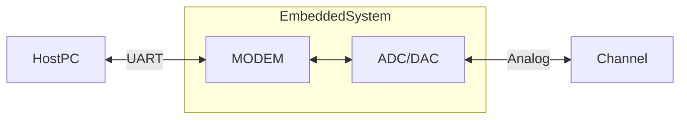

# ARM DSP Modem

## Overview
The goal of this project is to implement a simple MODEM using the ARM DSP
library. The general architecture respondos to the following diagram.

## Modem
### Modulator
The modulator is responsible for the following tasks:
- Receiving raw data and building "packets" that are comprised of three elements:
   - Message length 
   - Preamble length
   - Start of frame length 
- Generating modulated pulses from data:
  - Generating a zero padded impulse train signal from input data
  - Applying a modulation filter to the aforementioned impulse train signal

### Demodulator
The demodulator is responsible for the following tasks: 
- Applying the matched filter to the modulated signal captured by the ADC
- Detecting whether there's signal level or not
- Syncronizing the signal using a PLL block
- Sampling the matched filter output signal converting it to either 1s or 0s